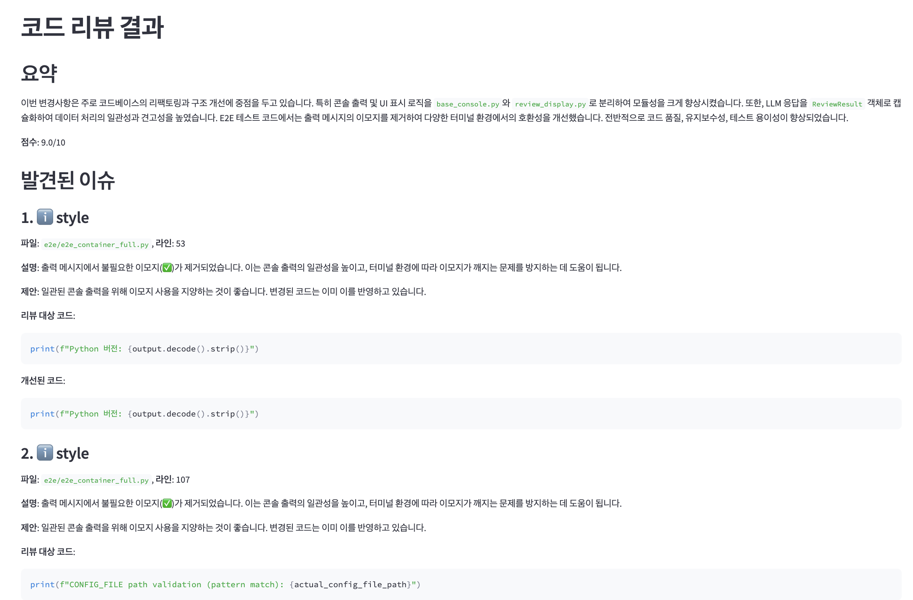

<h1 align="center">Selvage: AI-Powered Code Review Automation Tool</h1>

<p align="center">🌐 <a href="README_KR.md"><strong>한국어</strong></a></p>

<p align="center"><strong>A modern CLI tool that helps AI analyze Git diffs to improve code quality, find bugs, and identify security vulnerabilities.</strong></p>

<p align="center">🤖 <strong>AI Agents</strong>: Read our documentation at <code>https://selvage.ai/llms.txt</code></p>

<p align="center">
  <a href="https://pypi.org/project/selvage/"></a>
  <a href="LICENSE"></a>
  
  
</p>

<!-- TODO: Add demo GIF -->
<!-- <p align="center">  </p> -->

<p align="center">
  <a href="https://pub-96dcfc8e21ae4525bb6f566e02497d31.r2.dev/assets/489282979-338766d9-535e-47cb-ad10-1f8ce069401d.mp4" target="_blank"><strong>▶ Watch Demo Video</strong></a>
</p>

**Selvage: Code reviews with an edge!**

No more waiting for reviews! AI instantly analyzes your code changes to provide quality improvements and bug prevention.
With smart context analysis (AST-based) that's accurate and cost-effective, plus multi-turn processing for large codebases - seamlessly integrated with all Git workflows.

<details>
<summary><strong>Table of Contents</strong></summary>

- [✨ Key Features](#-key-features)
- [🚀 Quick Start](#-quick-start)
- [🎯 Practical Usage Guide](#-practical-usage-guide)
  - [MCP Mode Usage](#mcp-mode-usage)
  - [⌨️ CLI Usage](#️-cli-usage)
- [🌐 Smart Context Analysis and Supported AI Models](#-smart-context-analysis-and-supported-ai-models)
  - [🎯 Smart Context Analysis](#-smart-context-analysis)
  - [Supported AI Models](#supported-ai-models)
- [📄 Review Result Storage Format](#-review-result-storage-format)
- [🔧 Troubleshooting](#-troubleshooting)
- [🤝 Contributing](#-contributing)
- [📜 License](#-license)
- [📋 Change Log](#-change-log)
- [📞 Contact and Community](#-contact-and-community)

</details>

## ✨ Key Features

- **🤖 Multiple AI Model Support**: Leverage the latest LLM models including OpenAI GPT-5, Anthropic Claude Sonnet-4, Google Gemini, and more
- **🔍 Git Workflow Integration**: Support for analyzing staged, unstaged, and changes between specific commits/branches
- **🎯 Optimized Context Analysis**: Tree-sitter based AST analysis automatically extracts the smallest code blocks containing changed lines along with their dependency statements, providing contextually optimized information for each situation
- **🔄 Automatic Multi-turn Processing**: Automatic prompt splitting when context limits are exceeded, supporting stable large-scale code reviews (Large Context Mode now auto-triggers once total tokens exceed 200k, even without provider errors)
- **🤖 MCP Mode Support**: Register as MCP mode in Cursor, Claude Code, etc., and request code reviews through natural language like "Review current changes"
- **🔌 Claude Code Plugin**: Install via marketplace with a single command — includes dedicated `/review` skill and `selvage-reviewer` agent for seamless integration
- **🧠 Agent-Delegated Review (`get_review_context`)**: Returns structured review context (diff + Smart Context + system prompt) so host agents (Claude Code, Cursor, Antigravity, etc.) can perform code reviews with their own LLM — **no API key required**
- **📖 Open Source**: Freely use and modify under Apache-2.0 License

## 🚀 Quick Start

### Common Setup

#### 1. Installation

**Recommended Method (using uv)**

```bash
# Install uv (run once)
curl -LsSf https://astral.sh/uv/install.sh | sh

# Install Selvage
uv tool install selvage
```

**Alternative Method (using pipx)**

```bash
# Install pipx (macOS)
brew install pipx

# Install Selvage
pipx install selvage
```

**Traditional Method (pip)**

```bash
# ⚠️ May cause externally-managed-environment error on some systems
pip install selvage
```

**macOS/Linux users**: If you encounter errors with `pip install`, please use the uv or pipx methods above.

#### 2. API Key Setup

Get an API key from [OpenRouter](https://openrouter.ai) and set it up:

```bash
export OPENROUTER_API_KEY="your_openrouter_api_key_here"
```

### MCP Mode Usage (Recommended)

Register as MCP mode in Cursor, Claude Code, etc., to request code reviews through natural language.

#### Cursor Integration

Register in Cursor's MCP configuration file (path may vary depending on user environment):

**Common path:** `~/.cursor/mcp.json`

```json
// Method 1: Using environment variables (if already set)
{
  "mcpServers": {
    "selvage": {
      "command": "uvx",
      "args": ["selvage", "mcp"]
    }
  }
}

// Method 2: Direct specification
{
  "mcpServers": {
    "selvage": {
      "command": "uvx",
      "args": ["selvage", "mcp"],
      "env": {
        "OPENROUTER_API_KEY": "your_openrouter_api_key_here"
      }
    }
  }
}
```

#### Claude Code Integration

##### Method A: Plugin via Marketplace (Recommended)

Install the Selvage plugin from the marketplace to get the dedicated `/review` skill and `selvage-reviewer` agent:

```bash
# Step 1: Add Selvage marketplace
/plugin marketplace add selvage-lab/selvage

# Step 2: Install the plugin
/plugin install selvage@selvage-lab-selvage
```

After installation, use the `/review` skill directly:

```
/review                      # Review unstaged changes
/review staged               # Review staged changes
/review branch main          # Review against main branch
/review commit abc1234       # Review from specific commit
```

> 💡 **No API key required!** The plugin uses `get_review_context` to leverage Claude Code's own LLM for code review, so no external API key is needed.

##### Method B: MCP Server Registration

```bash
# Method 1: Using environment variables (if already set)
claude mcp add selvage -- uvx selvage mcp

# Method 2: Direct specification
claude mcp add selvage -e OPENROUTER_API_KEY=your_openrouter_api_key_here -- uvx selvage mcp
```

#### Usage

After restarting your IDE, request reviews from your Coding Assistant:

```
Please review current changes using selvage mcp
Review changes between current branch and main branch using claude-sonnet-4-thinking with selvage mcp
```

🎉 **Done!** Selvage will analyze the code, review it, and deliver results through your Coding Assistant.

### CLI Mode Usage

For direct terminal usage:

```bash
selvage review --model claude-sonnet-4-thinking
```

**💡 More Options:** [CLI Usage](#️-cli-usage) | [Practical Usage Guide](#-practical-usage-guide)

---

## 🎯 Practical Usage Guide

### MCP Mode Usage

#### Basic Usage

```
# Basic review request
Please review current changes using selvage mcp

# Review staged changes
Review staged work using gpt-5-high with selvage mcp

# Review against specific branch
Review current branch against main branch using selvage mcp

# Review with automatic model selection
Review current branch against main branch using selvage mcp, automatically selecting appropriate model
```

#### Agent-Delegated Review (No API Key Required)

The `get_review_context` tool returns structured review context so host agents can perform code reviews with their own LLM — **no Selvage API key needed**.

```
# Request agent-delegated review context
Get review context for current changes using selvage mcp, then review the code

# Agent-delegated review for staged changes
Get review context for staged changes using selvage mcp

# Agent-delegated review against branch
Get review context comparing current branch to main using selvage mcp
```

> 💡 **How it works**: Selvage extracts diff + AST-based Smart Context + system prompt and returns it as structured context. The host agent (Claude Code, Cursor, Antigravity, etc.) then performs the review directly with its own LLM, without needing an external API key.

#### Advanced Workflows

**Multi-model Comparison Review**

```
Review staged work using both gpt-5-high and claude-sonnet-4-thinking with selvage mcp, then compare the results
```

**Stepwise Code Improvement Workflow**

```
1. Review current changes using claude-sonnet-4-thinking with selvage mcp
2. Critically evaluate review feedback for validity against current codebase and set priorities
3. Apply improvements sequentially based on established priorities
```

**CI/CD Integration Scenarios**

```
# Code quality verification before PR creation
Review changes against main branch using selvage mcp for code quality verification before PR creation

# Final check before deployment
Perform comprehensive review of staged changes using selvage mcp for final check before deployment
```

### ⌨️ CLI Usage

Direct terminal usage method. While MCP mode is recommended, CLI is useful for scripts and CI/CD.

#### Configuring Selvage

```bash
# View all settings
selvage config list

# Set default model
selvage config model <model_name>

# Set default language
selvage config language <language_name>

```

#### Code Review

```bash
selvage review [OPTIONS]
```

##### Key Options

- `--repo-path <path>`: Git repository path (default: current directory)
- `--staged`: Review only staged changes
- `--target-commit <commit_id>`: Review changes from specific commit to HEAD (e.g., abc1234)
- `--target-branch <branch_name>`: Review changes between current branch and specified branch (e.g., main)
- `--model <model_name>`: AI model to use (e.g., claude-sonnet-4-thinking)
- `--open-ui`: Automatically launch UI after review completion
- `--no-print`: Don't output review results to terminal (terminal output enabled by default)
- `--skip-cache`: Perform new review without using cache

##### Usage Examples

```bash
# Review current working directory changes
selvage review

# Final check before commit
selvage review --staged

# Review specific files only
git add specific_files.py && selvage review --staged

# Code review before sending PR
selvage review --target-branch develop

# Quick and economical review for simple changes
selvage review --model gemini-2.5-flash

# Review and then view detailed results in web UI
selvage review --target-branch main --open-ui
```

#### Git Workflow Integration

##### Team Collaboration Scenarios

```bash
# Code quality verification before Pull Request creation
selvage review --target-branch main --model claude-sonnet-4-thinking

# Pre-analysis of changes for code reviewers
selvage review --target-branch develop --model claude-sonnet-4-thinking

# Comprehensive review of all changes after specific commit
selvage review --target-commit a1b2c3d --model claude-sonnet-4-thinking
```

##### Development Stage Quality Management

```bash
# Quick feedback during development (before WIP commit)
selvage review --model gemini-2.5-flash

# Final verification of staged changes (before commit)
selvage review --staged --model claude-sonnet-4-thinking

# Emergency review before hotfix deployment
selvage review --target-branch main --model claude-sonnet-4-thinking
```

##### Large-scale Code Review

```bash
# Large codebases are automatically handled
selvage review --model claude-sonnet-4  # Usage is the same, multi-turn processing automatically applied after detection
```

Selvage automatically handles large code changes that exceed LLM model context limits.
Once usage reaches roughly 200k tokens (tiktoken basis), Large Context Mode starts automatically, so just wait for it to complete.

##### Cost Optimization

```bash
# Use economical models for small changes
selvage review --model gemini-2.5-flash
```

#### Viewing Results

Review results are **output directly to the terminal** and automatically saved to files simultaneously.

For **additional review management and re-examination**, you can use the web UI:

```bash
# Manage all saved review results in web UI
selvage view

# Run UI on different port
selvage view --port 8502
```

**Key UI Features:**

- 📋 Display list of all review results
- 🎨 Markdown format display
- 🗂️ JSON structured result view

---

## 🌐 Smart Context Analysis and Supported AI Models

### 🎯 Smart Context Analysis

Selvage uses **Tree-sitter based AST analysis** to precisely extract only the code blocks related to changed lines, **ensuring both cost efficiency and review quality simultaneously**.

#### How Smart Context Works

- **Precise Extraction**: Extracts only the minimal function/class blocks containing changed lines + related dependencies (imports, etc.)
- **Cost Optimization**: Dramatically reduces token usage by sending only necessary context instead of entire files
- **Quality Assurance**: Maintains high review accuracy through AST-based precise code structure understanding

#### Smart Context Automatic Application

Selvage analyzes file size and change scope to **automatically select the most efficient review method**:

```
🎯 Small Changes           → Fast and accurate analysis with Smart Context
📄 Small Files            → Complete context understanding with full file analysis
📋 Partial Edits in Large Files → Focused analysis of related code with Smart Context
📚 Large Changes in Big Files   → Comprehensive review with full file analysis
```

> 💡 **Automatic Optimization**: The optimal analysis method for each situation is automatically applied without requiring any manual configuration.

#### Smart Context Supported Languages

- **Python**, **JavaScript**, **TypeScript**, **Java**, **Kotlin**

#### Universal Context Extraction Support

- **Major Programming Languages**: Go, Ruby, PHP, C#, C/C++, Rust, Swift, Dart, etc.

> 🚀 **Universal context extraction method** provides **excellent code review quality** for major programming languages.
> Smart Context supported languages are continuously expanding.

---

### Supported AI Models

🚀 **Manage all models below with just one OpenRouter API key!**

#### OpenAI Models (OpenRouter or OpenAI API Key)

- **gpt-5.3-codex**: ⭐ **Recommended** - Latest Codex model for long-running agentic coding (400K context)

#### Anthropic Models (OpenRouter or Anthropic API Key)

- **claude-opus-4.8**: ⭐ **Recommended** - Most capable generally available Opus model with adaptive thinking (1M context)
- **claude-sonnet-5**: Frontier intelligence at Sonnet speed with adaptive thinking (1M context)
- **claude-haiku-4.5**: Fastest Claude model with near-frontier intelligence (200K context)

#### Google Models (OpenRouter or Google API Key)

- **gemini-3.1-pro**: ⭐ **Recommended** - Latest Pro reasoning model for multimodal and agentic workflows (1M+ tokens)

#### 🌟 OpenRouter Provided Models (OpenRouter API Key Only)

- **minimax-m3** (MiniMax): ⭐ **Recommended** - Multimodal long-context model for coding and agentic work (1M context)
- **glm-5.2** (Z.ai): Large-scale reasoning model for project-level software engineering (1M context)
- **qwen3.7-max** (Qwen): Flagship model for coding and long-horizon autonomous execution (1M context)
- **kimi-k3** (Moonshot AI): Multimodal reasoning model for complex coding and agentic workflows (1M context)
- **deepseek-v4-pro** (DeepSeek): Flagship reasoning and coding model (1M context)

## 📄 Review Result Storage Format

Review results are saved as **structured files** simultaneously with terminal output:

- **📋 Markdown Format**: Clean structure that's easy for humans to read, including summary, issue list, and improvement suggestions
- **🔧 JSON Format**: For programmatic processing and integration with other tools

<p align="center">
  
</p>

## 💡 Advanced Settings (For Developers/Contributors)

<details>
<summary><strong>Development and Advanced Settings Options</strong></summary>

### Development Version Installation

#### Using uv (recommended)

```bash
git clone https://github.com/selvage-lab/selvage.git
cd selvage

# Install all development dependencies automatically
uv sync --dev --extra e2e

# Run
uv run selvage --help
```

#### Using pip

```bash
git clone https://github.com/selvage-lab/selvage.git
cd selvage
pip install -e .
```

### Development Environment Installation

#### Using uv (recommended)

```bash
# Development dependencies only
uv sync --dev

# E2E test environment included
uv sync --dev --extra e2e

# Run tests
uv run pytest tests/
```

#### Using pip

```bash
# Install with development dependencies (pytest, build, etc.)
pip install -e .[dev]

# Install with development + E2E test environment (testcontainers, docker, etc.)
pip install -e .[dev,e2e]
```

### Individual Provider API Key Usage

You can also set individual provider API keys instead of OpenRouter:

```bash
export OPENAI_API_KEY="your_openai_api_key_here"
export ANTHROPIC_API_KEY="your_anthropic_api_key_here"
export GEMINI_API_KEY="your_gemini_api_key_here"
```

### Development and Debugging Settings

```bash
# Set default model to use (for advanced users)
selvage config model claude-sonnet-4-thinking

# Check configuration
selvage config list

# Enable debug mode (for troubleshooting and development)
selvage config debug-mode on
```

</details>

## 🔧 Troubleshooting

### Installation Errors

**`externally-managed-environment` Error (macOS/Linux)**

```bash
# Solution 1: Use uv (recommended)
curl -LsSf https://astral.sh/uv/install.sh | sh
uv tool install selvage

# Solution 2: Use pipx
brew install pipx  # macOS
pipx install selvage

# Solution 3: Use virtual environment
python3 -m venv ~/.selvage-env
source ~/.selvage-env/bin/activate
pip install selvage
```

### API Key Errors

```bash
# Check environment variable
echo $OPENROUTER_API_KEY

# Permanent setup (Linux/macOS)
echo 'export OPENROUTER_API_KEY="your_key_here"' >> ~/.bashrc
source ~/.bashrc
```

**Model not found Error**

```bash
# Check available model list
selvage models

# Use correct model name
selvage review --model claude-sonnet-4-thinking
```

**Network Connection Error**

```bash
# Retry ignoring cache
selvage review --skip-cache

# Check detailed info with debug mode
selvage config debug-mode on
selvage review
```

## 🤝 Contributing

Selvage is an open-source project and we always welcome your contributions! Bug reports, feature suggestions, documentation improvements, code contributions - any form of contribution is appreciated.

**How to Contribute:**

- 🐛 Bug reports or feature suggestions on [GitHub Issues](https://github.com/selvage-lab/selvage/issues)
- 🔧 Code contributions through Pull Requests
- 📚 Documentation improvements and translations

**Detailed contribution guidelines can be found in [CONTRIBUTING.md](CONTRIBUTING.md).**

## 📜 License

Selvage is distributed under the [Apache License 2.0](LICENSE). This license permits commercial use, modification, and distribution, with comprehensive patent protection and trademark restrictions included.

## 📋 Change Log

Check out all version changes and new features of Selvage.

**[📋 View Complete Change Log →](CHANGELOG.md)**

You can find detailed changes for each version, including new features, bug fixes, and performance improvements.

## 📞 Contact and Community

- **🐛 Bug Reports and Feature Requests**: [GitHub Issues](https://github.com/selvage-lab/selvage/issues)
- **📧 Direct Contact**: contact@selvage.me

---

<p align="center">
  <strong>Write better code with Selvage! 🚀</strong><br>
  ⭐ If this project helped you, please give us a Star on GitHub!
</p>

<!-- mcp-name: io.github.selvage-lab/selvage -->
