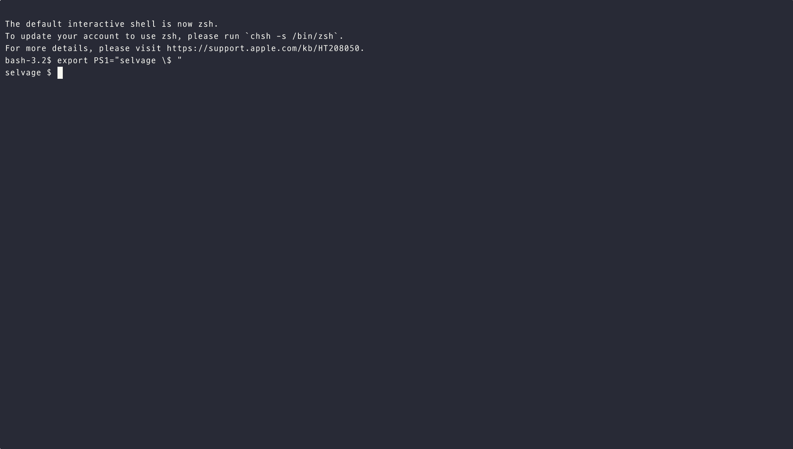

<h1 align="center">Selvage: AI 기반 코드 리뷰 자동화 도구</h1>

<p align="center"><strong>Git diff를 AI가 분석하여 코드 품질 향상, 버그 발견, 보안 취약점 식별을 도와주는 현대적인 CLI 도구입니다.</strong></p>

<p align="center">
  <a href="https://pypi.org/project/selvage/"></a>
  <a href="LICENSE"></a>
  
  
</p>

<!-- TODO: 데모 GIF 추가 -->
<!-- <p align="center">  </p> -->

<p align="center">
  
</p>

**Selvage : 코드 마감까지 탄탄하게!**

동료의 리뷰를 기다리며 작업이 늦어지거나, 퇴근 무렵 쌓인 리뷰 요청에 발목 잡힌 경험이 있으신가요?  
Selvage는 이런 코드 리뷰 병목 현상을 해결하는 AI 기반 도구입니다.

Selvage는 최첨단 AI 모델(OpenAI GPT, Anthropic Claude, Google Gemini 등)을 활용하여 Git diff를 분석하는 커맨드 라인 도구입니다.  
Selvage에게 코드 변경사항에 대한 리뷰를 요청하면, AI가 코드를 분석하여 피드백을 즉시 제공합니다.  
이를 통해 코드 품질 향상, 잠재적 버그 조기 발견, 보안 강화는 물론, 개발자 생산성까지 크게 향상시킬 수 있습니다.

<details>
<summary><strong>Table of Contents</strong></summary>

- [✨ 주요 기능](#-주요-기능)
- [🚀 빠른 시작](#-빠른-시작)
  - [설치 방법](#설치-방법)
  - [설정](#설정)
  - [리뷰 실행하기](#리뷰-실행하기)
- [🌐 지원 언어 및 모델](#-지원-언어-및-모델)
  - [지원 파일 형식](#지원-파일-형식)
  - [지원 AI 모델](#지원-ai-모델)
- [⌨️ CLI 사용법](#️-cli-사용법)
  - [Selvage 설정하기](#selvage-설정하기)
  - [코드 리뷰하기](#코드-리뷰하기)
  - [결과 확인하기](#결과-확인하기)
- [📄 출력 형식](#-출력-형식)
- [🛠️ 고급 사용법](#️-고급-사용법)
- [🤝 기여하기](#-기여하기)
- [📜 라이선스](#-라이선스)
- [�� 문의 및 커뮤니티](#-문의-및-커뮤니티)

</details>

## ✨ 주요 기능

- **🤖 다양한 AI 모델 지원**: OpenAI GPT-4o, Anthropic Claude Sonnet-4, Google Gemini 등 최신 LLM 모델 활용
- **🔍 Git 워크플로우와 통합**: staged, unstaged, 특정 커밋/브랜치 간 변경사항 분석 지원
- **🐛 포괄적 코드 검토**: 버그 및 논리 오류 탐지, 코드 품질 및 가독성 향상 제안
- **🎯 최적화된 컨텍스트 분석**: Tree-sitter 기반 AST 분석을 통해 변경 라인이 속하는 가장 작은 코드 블록과 dependency statement를 자동 추출하여 상황에 따라 최적화된 컨텍스트 제공
- **🔄 자동 멀티턴 처리**: 컨텍스트 제한 초과 시 프롬프트를 자동 분할하여 안정적인 대용량 코드 리뷰 지원
- **📖 오픈소스**: MIT 라이선스로 자유롭게 사용 및 수정 가능

## 🚀 빠른 시작

### 설치 방법

#### 기본 설치 (운영 환경)

```bash
# PyPI에서 설치 (정식 출시 후 예정)
pip install selvage

# 또는 개발 버전 설치
git clone https://github.com/anomie7/selvage.git
cd selvage
pip install -e .
```

#### 개발 환경 설치

```bash
# 개발 의존성 포함 설치 (pytest, build 등)
pip install -e .[dev]

# 개발 + E2E 테스트 환경 설치 (testcontainers, docker 등)
pip install -e .[dev,e2e]
```

### 설정

#### 1. API 키 설정

**환경 변수로 설정 (권장)**

터미널 세션용:

```bash
export OPENAI_API_KEY="your_openai_api_key_here"
export ANTHROPIC_API_KEY="your_anthropic_api_key_here"
export GEMINI_API_KEY="your_gemini_api_key_here"
```

영구 설정 (zsh 사용자):

```bash
echo 'export OPENAI_API_KEY="your_api_key_here"' >> ~/.zshrc
echo 'export ANTHROPIC_API_KEY="your_api_key_here"' >> ~/.zshrc
echo 'export GEMINI_API_KEY="your_api_key_here"' >> ~/.zshrc
source ~/.zshrc
```

**CLI 명령어로 설정**

```bash
# OpenAI API 키 설정
selvage --set-openai-key

# Anthropic API 키 설정
selvage --set-claude-key

# Gemini API 키 설정
selvage --set-gemini-key
```

#### 2. 기본 모델 설정 (선택사항)

```bash
# 기본 사용할 모델 설정
selvage config model claude-sonnet-4-thinking

# 설정 확인
selvage config list
```

### 리뷰 실행하기

```bash
# 현재 워킹 디렉토리의 변경사항 리뷰
selvage review

# 스테이징된 변경사항만 리뷰
selvage review --staged

# 특정 모델로 리뷰
selvage review --model gemini-2.5-pro

# 리뷰 후 자동으로 UI 열기 (터미널 출력 비활성화)
selvage review --open-ui

# 터미널에 출력하지 않고 파일로만 저장
selvage review --no-print
```

리뷰 결과는 기본적으로 터미널에 출력되며 자동으로 파일에도 저장됩니다. `--open-ui` 옵션으로 UI를 열거나 `--no-print` 옵션으로 터미널 출력을 비활성화할 수 있습니다.

## 🌐 지원 언어 및 모델

### 지원 파일 형식

- **Python** (`.py`)
- **JavaScript** (`.js`)
- **TypeScript** (`.ts`)
- **Java** (`.java`)
- **Kotlin** (`.kt`, `.kts`)
- **Go** (`.go`)
- **Ruby** (`.rb`)
- **PHP** (`.php`)
- **C#** (`.cs`)
- **C/C++** (`.c`, `.cpp`, `.h`, `.hpp`)
- **HTML** (`.html`)
- **CSS/SCSS** (`.css`, `.scss`)
- **Shell** (`.sh`, `.bash`)
- **SQL** (`.sql`)
- **Markdown** (`.md`)
- **JSON** (`.json`)
- **YAML** (`.yaml`, `.yml`)
- **XML** (`.xml`)
- 기타 텍스트 기반 코드 파일

### 지원 AI 모델

#### OpenAI 모델

- **gpt-4o**: 고급 코드 분석 및 텍스트 처리 능력 (128K 컨텍스트)
- **gpt-4.1**: 대용량 코드베이스 분석 지원 (1M+ 토큰 컨텍스트)
- **o4-mini-high**: 높은 정확도의 추론 모델 (200K 컨텍스트)
- **o4-mini**: 균형 잡힌 추론 모델 (별칭: o4-mini-medium) (200K 컨텍스트)

#### Anthropic 모델

- **claude-sonnet-4**: 하이브리드 추론 모델로 고급 코딩 최적화 (200K 컨텍스트)
- **claude-sonnet-4-thinking**: ⭐ **추천** - 확장 사고 프로세스 지원 (200K 컨텍스트)

#### Google 모델

- **gemini-2.5-pro**: ⭐ **추천** - 대용량 컨텍스트 및 고급 추론 (1M+ 토큰)
- **gemini-2.5-flash**: ⭐ **추천** - 응답 속도와 비용 효율성 최적화 (1M+ 토큰)

#### OpenRouter를 통한 모델

- **qwen3-coder** (Qwen): 480B 파라미터 MoE 코딩 특화 모델 (1M+ 토큰)
- **kimi-k2** (Moonshot AI): 1T 파라미터 MoE 대용량 추론 모델 (128K 토큰)

## ⌨️ CLI 사용법

### Selvage 설정하기

```bash
# 모든 설정 보기
selvage config list

# 기본 모델 설정
selvage config model <모델명>

# 디버그 모드 설정
selvage config debug-mode on

```

### 코드 리뷰하기

```bash
selvage review [OPTIONS]
```

#### 주요 옵션

- `--repo-path <경로>`: Git 저장소 경로 (기본값: 현재 디렉토리)
- `--staged`: 스테이징된 변경사항만 리뷰
- `--target-commit <커밋ID>`: 특정 커밋부터 HEAD까지의 변경사항 리뷰 (예: abc1234)
- `--target-branch <브랜치명>`: 현재 브랜치와 지정된 브랜치 간 변경사항 리뷰 (예: main)
- `--model <모델명>`: 사용할 AI 모델 (예: claude-sonnet-4-thinking)
- `--open-ui`: 리뷰 완료 후 자동으로 UI 실행
- `--no-print`: 터미널에 리뷰 결과를 출력하지 않음 (기본적으로 터미널 출력 활성화)

#### 사용 예시

```bash
# 현재 워킹 디렉토리 변경사항 리뷰
selvage review

# 스테이징된 변경사항을 Claude로 리뷰
selvage review --staged --model claude-sonnet-4-thinking

# 리뷰 후 터미널에 출력하지 않음 (파일로만 저장)
selvage review --no-print --model gemini-2.5-flash

# main 브랜치와 현재 브랜치 간 차이점 리뷰 후 UI 열기
selvage review --target-branch main --open-ui

# 특정 커밋 이후 변경사항 리뷰 (기본적으로 터미널 출력)
selvage review --target-commit abc1234 --model gemini-2.5-pro
```

### 결과 확인하기

```bash
# 저장된 리뷰 결과를 UI로 보기
selvage view

# 다른 포트에서 UI 실행
selvage view --port 8502
```

**UI 주요 기능:**

- 📋 모든 리뷰 결과 목록 표시
- 🎨 마크다운 형식 표시
- 🗂️ JSON 구조화된 결과 보기

## 📄 출력 형식

<p align="center">
  
</p>

### Markdown (기본값)

- 📖 사람이 읽기 편한 깔끔한 구조
- 📝 요약, 이슈 목록, 개선 제안 포함
- 🎯 중요도별 이슈 분류
- 💡 실행 가능한 개선 방안 제시

### JSON

- 🔧 프로그래밍 방식으로 처리 용이
- ⚙️ 구조화된 데이터 형식
- 🔗 다른 도구와의 통합에 유용
- 📊 자동화 파이프라인에 적합

## 🛠️ 고급 사용법

### 모델별 최적 사용 시나리오

```bash
# 복잡한 로직 분석 - Claude 추천
selvage review --model claude-sonnet-4-thinking

# 대용량 코드베이스 - Gemini 추천
selvage review --model gemini-2.5-pro

# 빠른 리뷰 - Gemini Flash 추천
selvage review --model gemini-2.5-flash
```

### 다양한 Git 워크플로우와 통합

```bash
# PR 리뷰 전 체크
selvage review --target-branch main

# 커밋 전 최종 검토
selvage review --staged --open-ui

# 특정 기능 브랜치 전체 리뷰
selvage review --target-branch develop
```

### 대용량 코드 리뷰

```bash
# 대용량 코드베이스도 자동으로 처리
selvage review --model claude-sonnet-4  # 사용 방법은 동일, 자동 감지 후 멀티턴 처리 적용
```

Selvage는 LLM model의 컨텍스트 제한을 초과하는 대용량 코드 변경사항도 자동으로 처리합니다. 프롬프트를 지능적으로 분할하여 순차 처리 후 결과를 합성해 제공합니다.

### 비용 최적화

```bash
# 작은 변경사항에는 경제적인 모델 사용
selvage review --model gemini-2.5-flash
```

## 🤝 기여하기

Selvage는 오픈소스 프로젝트이며, 여러분의 기여를 언제나 환영합니다! 버그 리포트, 기능 제안, 문서 개선, 코드 기여 등 어떤 형태의 기여든 좋습니다.

**기여 방법:**

- 🐛 [GitHub Issues](https://github.com/anomie7/selvage/issues)에서 버그 리포트 또는 기능 제안
- 🔧 Pull Request를 통한 코드 기여
- 📚 문서 개선 및 번역

**상세한 기여 가이드라인은 [CONTRIBUTING.md](CONTRIBUTING.md)에서 확인하실 수 있습니다.**

## 📜 라이선스

Selvage는 [MIT License](LICENSE) 하에 배포됩니다. 이 라이선스는 상업적 이용, 수정, 배포를 허용하며, 라이선스 및 저작권 고지를 포함하는 한 자유롭게 사용할 수 있습니다.

## 📞 문의 및 커뮤니티

- **🐛 버그 리포트 및 기능 요청**: [GitHub Issues](https://github.com/anomie7/selvage/issues)
- **📧 직접 문의**: anomie7777@gmail.com

---

<p align="center">
  <strong>Selvage와 함께 더 나은 코드를 작성하세요! 🚀</strong><br>
  ⭐ 프로젝트가 도움이 되셨다면 GitHub에서 Star를 눌러주세요!
</p>
