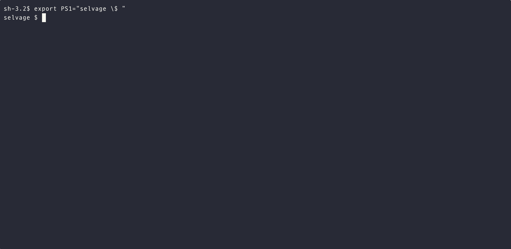
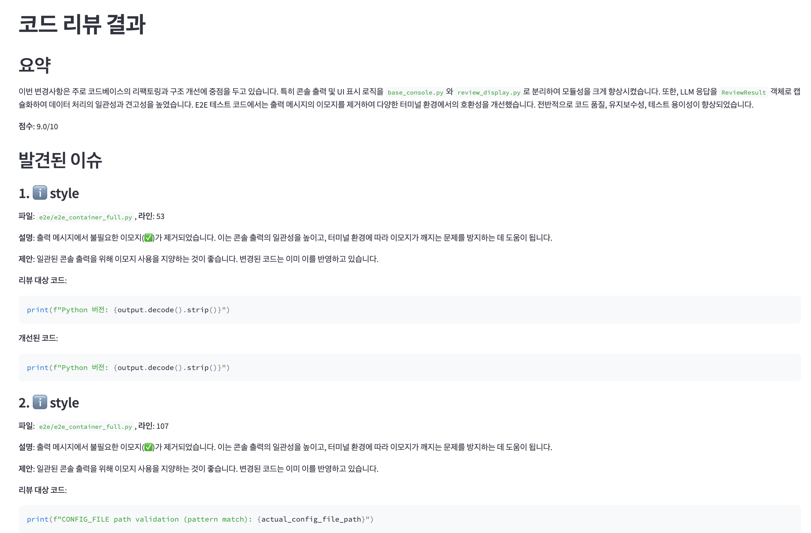

<h1 align="center">Selvage: AI-Powered Code Review Automation Tool</h1>

<p align="center">🌐 <a href="README.md"><strong>한국어</strong></a></p>

<p align="center"><strong>A modern CLI tool that helps AI analyze Git diffs to improve code quality, find bugs, and identify security vulnerabilities.</strong></p>

<p align="center">
  <a href="https://pypi.org/project/selvage/"></a>
  <a href="LICENSE"></a>
  
  
</p>

<!-- TODO: Add demo GIF -->
<!-- <p align="center">  </p> -->

<p align="center">
  
</p>

**Selvage: Code reviews with an edge!**

Have you ever experienced delays waiting for peer reviews, or been held up by a pile of review requests at the end of the day?  
Selvage is an AI-powered tool that solves these code review bottlenecks.

Selvage is a command-line tool that leverages cutting-edge AI models (OpenAI GPT, Anthropic Claude, Google Gemini, etc.) to analyze Git diffs.  
When you request a code review from Selvage, the AI analyzes your code and provides immediate feedback.  
This significantly improves code quality, enables early detection of potential bugs, enhances security, and greatly boosts developer productivity.

<details>
<summary><strong>Table of Contents</strong></summary>

- [✨ Key Features](#-key-features)
- [🚀 Quick Start](#-quick-start)
  - [Installation](#installation)
  - [Setup](#setup)
  - [Running Reviews](#running-reviews)
- [🌐 Supported Languages and Models](#-supported-languages-and-models)
  - [Supported File Types](#supported-file-types)
  - [Supported AI Models](#supported-ai-models)
- [⌨️ CLI Usage](#️-cli-usage)
  - [Configuring Selvage](#configuring-selvage)
  - [Code Review](#code-review)
  - [Viewing Results](#viewing-results)
- [📄 Output Formats](#-output-formats)
- [🛠️ Advanced Usage](#️-advanced-usage)
- [🤝 Contributing](#-contributing)
- [📜 License](#-license)
- [📞 Contact and Community](#-contact-and-community)

</details>

## ✨ Key Features

- **🤖 Multiple AI Model Support**: Leverage the latest LLM models including OpenAI GPT-4o, Anthropic Claude Sonnet-4, Google Gemini, and more
- **🔍 Git Workflow Integration**: Support for analyzing staged, unstaged, and specific commit/branch changes
- **🐛 Comprehensive Code Review**: Bug and logic error detection, code quality and readability improvement suggestions
- **🎯 Optimized Context Analysis**: Automatic extraction of the smallest code blocks and dependency statements containing changed lines through Tree-sitter based AST analysis, providing contextually optimized information
- **🔄 Automatic Multi-turn Processing**: Automatic prompt splitting when context limits are exceeded, supporting stable large-scale code reviews
- **📖 Open Source**: Freely use and modify under MIT License

## 🚀 Quick Start

### Installation

#### Basic Installation (Production Environment)

```bash
# Install from PyPI (planned after official release)
pip install selvage

# Or install development version
git clone https://github.com/anomie7/selvage.git
cd selvage
pip install -e .
```

#### Development Environment Installation

```bash
# Install with development dependencies (pytest, build, etc.)
pip install -e .[dev]

# Install with development + E2E test environment (testcontainers, docker, etc.)
pip install -e .[dev,e2e]
```

### Setup

#### 1. API Key Configuration

**Environment Variables (Recommended)**

For terminal session:

```bash
export OPENAI_API_KEY="your_openai_api_key_here"
export ANTHROPIC_API_KEY="your_anthropic_api_key_here"
export GEMINI_API_KEY="your_gemini_api_key_here"
```

Permanent setup (zsh users):

```bash
echo 'export OPENAI_API_KEY="your_api_key_here"' >> ~/.zshrc
echo 'export ANTHROPIC_API_KEY="your_api_key_here"' >> ~/.zshrc
echo 'export GEMINI_API_KEY="your_api_key_here"' >> ~/.zshrc
source ~/.zshrc
```

**CLI Command Setup**

```bash
# Set OpenAI API key
selvage --set-openai-key

# Set Anthropic API key
selvage --set-claude-key

# Set Gemini API key
selvage --set-gemini-key
```

#### 2. Default Model Configuration (Optional)

```bash
# Set default model to use
selvage config model claude-sonnet-4-thinking

# Check configuration
selvage config list
```

### Running Reviews

```bash
# Review changes in current working directory
selvage review

# Review only staged changes
selvage review --staged

# Review with specific model
selvage review --model gemini-2.5-pro

# Auto-open UI after review
selvage review --open-ui

# Save to file only without terminal output
selvage review --no-print
```

Review results are output to the terminal by default and automatically saved to files. You can open the UI with the `--open-ui` option or disable terminal output with the `--no-print` option.

## 🌐 Supported Languages and Models

### Supported File Types

- **Python** (`.py`)
- **JavaScript** (`.js`)
- **TypeScript** (`.ts`)
- **Java** (`.java`)
- **Kotlin** (`.kt`, `.kts`)
- **Go** (`.go`)
- **Ruby** (`.rb`)
- **PHP** (`.php`)
- **C#** (`.cs`)
- **C/C++** (`.c`, `.cpp`, `.h`, `.hpp`)
- **HTML** (`.html`)
- **CSS/SCSS** (`.css`, `.scss`)
- **Shell** (`.sh`, `.bash`)
- **SQL** (`.sql`)
- **Markdown** (`.md`)
- **JSON** (`.json`)
- **YAML** (`.yaml`, `.yml`)
- **XML** (`.xml`)
- Other text-based code files

### Supported AI Models

#### OpenAI Models

- **gpt-4o**: Advanced code analysis and text processing capabilities (128K context)
- **gpt-4.1**: Support for large codebase analysis (1M+ token context)
- **o4-mini-high**: High-accuracy reasoning model (200K context)
- **o4-mini**: Balanced reasoning model (alias: o4-mini-medium) (200K context)

#### Anthropic Models

- **claude-sonnet-4**: Hybrid reasoning model optimized for advanced coding (200K context)
- **claude-sonnet-4-thinking**: ⭐ **Recommended** - Extended thinking process support (200K context)

#### Google Models

- **gemini-2.5-pro**: ⭐ **Recommended** - Large context and advanced reasoning (1M+ tokens)
- **gemini-2.5-flash**: ⭐ **Recommended** - Optimized for response speed and cost efficiency (1M+ tokens)

#### Models via OpenRouter

- **qwen3-coder** (Qwen): 480B parameter MoE coding-specialized model (1M+ tokens)
- **kimi-k2** (Moonshot AI): 1T parameter MoE large-scale reasoning model (128K tokens)

## ⌨️ CLI Usage

### Configuring Selvage

```bash
# View all settings
selvage config list

# Set default model
selvage config model <model_name>

# Set debug mode
selvage config debug-mode on

```

### Code Review

```bash
selvage review [OPTIONS]
```

#### Key Options

- `--repo-path <path>`: Git repository path (default: current directory)
- `--staged`: Review only staged changes
- `--target-commit <commit_id>`: Review changes from specific commit to HEAD (e.g., abc1234)
- `--target-branch <branch_name>`: Review changes between current branch and specified branch (e.g., main)
- `--model <model_name>`: AI model to use (e.g., claude-sonnet-4-thinking)
- `--open-ui`: Automatically launch UI after review completion
- `--no-print`: Don't output review results to terminal (terminal output enabled by default)

#### Usage Examples

```bash
# Review current working directory changes
selvage review

# Review staged changes with Claude
selvage review --staged --model claude-sonnet-4-thinking

# Don't output to terminal after review (save to file only)
selvage review --no-print --model gemini-2.5-flash

# Review differences between main branch and current branch, then open UI
selvage review --target-branch main --open-ui

# Review changes after specific commit (terminal output by default)
selvage review --target-commit abc1234 --model gemini-2.5-pro
```

### Viewing Results

```bash
# View saved review results in UI
selvage view

# Run UI on different port
selvage view --port 8502
```

**Key UI Features:**

- 📋 Display list of all review results
- 🎨 Markdown format display
- 🗂️ JSON structured result view

## 📄 Output Formats

<p align="center">
  
</p>

### Markdown (Default)

- 📖 Clean structure that's easy for humans to read
- 📝 Includes summary, issue list, and improvement suggestions
- 🎯 Issues categorized by importance
- 💡 Actionable improvement recommendations

### JSON

- 🔧 Easy to process programmatically
- ⚙️ Structured data format
- 🔗 Useful for integration with other tools
- 📊 Suitable for automation pipelines

## 🛠️ Advanced Usage

### Optimal Use Cases by Model

```bash
# Complex logic analysis - Claude recommended
selvage review --model claude-sonnet-4-thinking

# Large codebase - Gemini recommended
selvage review --model gemini-2.5-pro

# Quick review - Gemini Flash recommended
selvage review --model gemini-2.5-flash
```

### Integration with Various Git Workflows

```bash
# Pre-PR review check
selvage review --target-branch main

# Final review before commit
selvage review --staged --open-ui

# Full feature branch review
selvage review --target-branch develop
```

### Large-scale Code Review

```bash
# Large codebases are automatically handled
selvage review --model claude-sonnet-4  # Usage is the same, multi-turn processing automatically applied after detection
```

Selvage automatically handles large code changes that exceed LLM model context limits. It intelligently splits prompts for sequential processing and then synthesizes the results.

### Cost Optimization

```bash
# Use economical models for small changes
selvage review --model gemini-2.5-flash
```

## 🤝 Contributing

Selvage is an open-source project and we always welcome your contributions! Bug reports, feature suggestions, documentation improvements, code contributions - any form of contribution is appreciated.

**How to Contribute:**

- 🐛 Bug reports or feature suggestions on [GitHub Issues](https://github.com/anomie7/selvage/issues)
- 🔧 Code contributions through Pull Requests
- 📚 Documentation improvements and translations

**Detailed contribution guidelines can be found in [CONTRIBUTING.md](CONTRIBUTING.md).**

## 📜 License

Selvage is distributed under the [MIT License](LICENSE). This license permits commercial use, modification, and distribution, and can be used freely as long as license and copyright notices are included.

## 📞 Contact and Community

- **🐛 Bug Reports and Feature Requests**: [GitHub Issues](https://github.com/anomie7/selvage/issues)
- **📧 Direct Contact**: anomie7777@gmail.com

---

<p align="center">
  <strong>Write better code with Selvage! 🚀</strong><br>
  ⭐ If this project helped you, please give us a Star on GitHub!
</p>